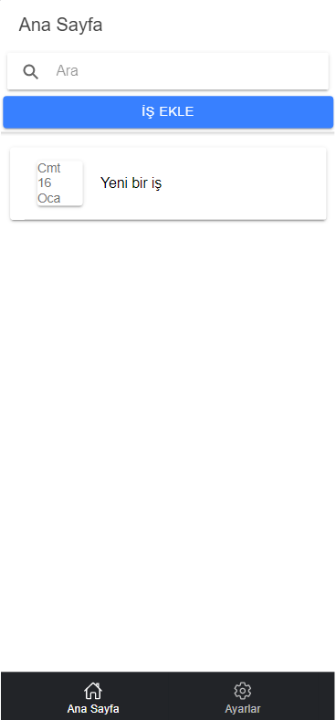

# MobilProg-IonicProject
Projenin amacı işlerimizi not almaktır. 
Şuanda iş ekleme , eklenen bir işi güncelleme ve silme işlevleri mevcuttur.

Ana sayfa üzerinde yeni bir iş ekleyip eklenen bu işlerin listelenmesi yapılmaktadır. Aynı zamanda işleri filtrelemek için search yeri de bulunmaktadır.

İş Ekle butonuna tıklayınca model mantığı ile iş ekleme sayfası anasayfanın üstünde açılmaktadır. 

Listelenen işleri görüntülemek için işin üzerine tıklamak yeterli. Yine model mantığı ile anasayfanın üstünde sayfa açılıyor.
Her bir işi Job nesnesi türünde tutuyoruz. Bu nesneyi açılan sayfaya yönlendiriyoruz.

Kaydedilen işleri storage da depolamaktayım. Listelenirkende direkt storage den çekmekteyim. 
Ayrıca işleri jobun içindeki static bir array listinde tutarak güncellemeler dışında storage de işlem yapmıyoruz.
